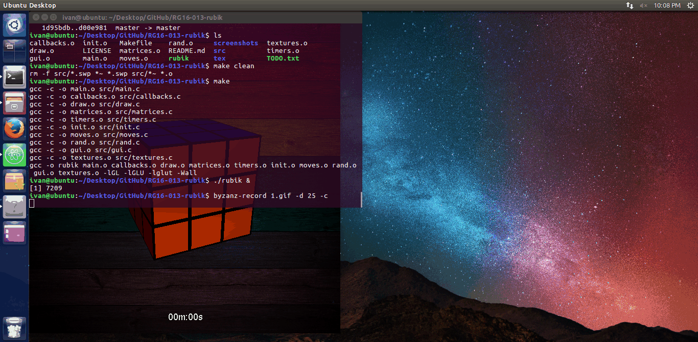

# RG16-013-rubik

Click **[here](https://www.youtube.com/watch?v=XGPYZhePjKo)** to watch a video explaining my project.

Latest screenshot:



## :page_facing_up: Description
Click **[here](https://en.wikipedia.org/wiki/Rubik%27s_Cube)** for more information about Rubik's cube.

This is a Computer Graphics course project - an interactive Rubik's cube in 3D.
Coded in C using OpenGL.

**Latest version:** 2016.12.23.00

## :computer: Installation
Navigate to the project root folder (where the **Makefile** is located), and compile the code by calling **make**:
```
make
```
:exclamation: **Note:** For **make** to work, you must have the OpenGL/GLUT/Freeglut libraries installed.
You can find them **[here](https://www.opengl.org/resources/libraries/glut/)**.

After that, run **rubik** executable:
```
./rubik
```

## :video_game: Usage
| **Key** | **Description** |
| :---  | :--- |
| ```Left click (drag)``` | Rotate selected layer in desired direction |
| ```Right click (drag)``` | Rotate whole cube in desired direction |
| ```U``` | Undo move |
| ```R``` | Reset the cube |
| ```T``` | Randomize cube |
| ```E``` | Toggle animations (for speedsolving) |
| ```SPACE``` | Toggle stopwatch |
| ```F``` | Toggle FPS display |
| ```ESC``` ```Q``` | Exit the program |
| | |
| ```W``` ```A``` ```S``` ```D``` | Rotate the whole cube |
| ```z``` ```Z``` | Rotate left vertical layer in positive / negative direction |
| ```x``` ```X``` | Rotate middle vertical layer in positive / negative direction |
| ```c``` ```C``` | Rotate right vertical layer in positive / negative direction |
| ```v``` ```V``` | Rotate top horizontal layer in positive / negative direction |
| ```b``` ```B``` | Rotate middle horizontal layer in positive / negative direction |
| ```n``` ```N``` | Rotate bottom horizontal layer in positive / negative direction |

## :bug: Known bugs
* Maximizing window does not display the scene properly and mouse controls are glitching.
